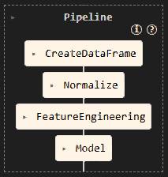

# Contexto do Projeto
Modelo preditivo de redes neurais Long Short Term Memory (LSTM) para predizer o valor de fechamento da bolsa de valores, no caso do Bitcoin.
# Arquitetura do Projeto


- **Yahoo Fincance**: Fonte de dados onde recuperamos os valores históricos/atual da criptomoeda bitcnoin.
- **Notebook LSTM**: Coleta dos dados, normalização dos dados, construção do modelo, treinamento, avaliação.
- **Amazon ECR**: Serviço de registro de imagens de contêiner (Docker) da AWS. Armazena a imagem Docker da API que serve o modelo LSTM treinado.
- **AWS Lambda**: Serviço de computação serverless da AWS. Executa a API de previsão de preços como função sem a necessidade de gerenciar servidores, utilizando a imagem armazenada no ECR.
- **Amazon API Gateway**: Responsável por expor endpoints HTTP públicos e rotear as requisições dos usuários para a função Lambda.
- **CloudWatch**: Serviço de monitoramento da AWS, que coleta logs e métricas da execução da Lambda, possibilitando análise de performance e troubleshooting.
- **Frontend (Streamlit)**: Interface gráfica simples que permite ao usuário inserir dados, enviar requisições à API e visualizar os resultados da previsão do valor do bitcoin.

# Desenvolvimento Modelo
Para desenvolvimento do modelo, utilizamos [este](./notebooks/Desenvolvimento_Modelo.ipynb) notebook.
## Coleta dos Dados
Os dados históricos do **Bitcoin (BTC-USD)** são coletados automaticamente da API do **Yahoo Finance**.
Para isso, utilizamos a função download da biblioteca yfinance, que permite obter facilmente cotações de ativos financeiros em diferentes períodos.
Os dados são filtrados para manter apenas o preço de fechamento diário (Close).
Amostras ausentes (valores nulos) são descartadas para garantir a qualidade da série.
## Exploração dos Dados (EDA)
Nesta etapa, é realizado um gráfico de linha mostrando a evolução do preço de fechamento do Bitcoin entre 2018 e 2025.
Também são apresentadas estatísticas descritivas (média, desvio padrão, valores mínimos e máximos) para fornecer um panorama rápido sobre a variação e tendências do ativo ao longo do tempo.
### Normalização
Antes de alimentar os dados no modelo LSTM, os valores do preço de fechamento são normalizados para o intervalo de 0 a 1, utilizando a técnica MinMaxScaler. Isso garante que o modelo aprenda padrões relevantes, independentemente da magnitude dos valores, acelerando o treinamento e evitando problemas de instabilidade numérica.
O normalizador é salvo para que, no momento da previsão em produção, seja possível aplicar a mesma transformação nos dados de entrada, mantendo a consistência dos resultados.
## Preparação dos dados
Os dados são organizados em sequências de 60 dias consecutivos. Cada sequência é usada como entrada para o modelo, com o objetivo de prever o valor do próximo dia. Essa abordagem permite ao LSTM capturar padrões temporais e dependências de longo prazo na série histórica de preços.
O formato resultante é:
- X: lista de janelas deslizantes de 60 dias cada
- y: o valor do próximo dia após cada janela
  
## Treino, Teste e Validação

A base de dados processada é dividida em dois subconjuntos:
- 80% para treino do modelo (onde ele aprende os padrões da série)
- 20% para validação (testar a capacidade de generalização do modelo em dados que ele nunca viu)

Essa separação é fundamental para garantir a avaliação justa da performance do modelo e evitar overfitting.

## Construção do modelo

Para construção do modelo é necessário criar a rede LSTM. Construímos uma função que é destinada para o treinamento da rede, que utiliza o `tensorflow` como base. Abaixo, a descrição dos parâmetros:
- window_size: Janela anterior às variáveis atuais, utilizada para criação da entrada do modelo. 
- input_size: Tamanho da entrada. Esse valor refere-se a quantidade de colunas que vão servir de entrada ao modelo.
- neuronios: Quantidade de neuronios disponíveis na rede.
- Dropout: Percentual de neoronios desligados na rede. Isso evita overfitting.
- loss_function: métrica de validação, para otimização dos parâmetros.
- epochs: Quantidade de épocas.
- batch_size: Quantidade de dados utilizado em cada etapa do treinamento.
- return_sequences=True: necessário pois temos 2 camadas LSTM
- Dense(1): saída de um valor, o preço previsto
### Estrutura de entrada e saída
A entrada da rede é um vetor de 60 posições e saída é o valor escalar.
### Ajustes dos hyperparâmetros
Os parâmetros da construção do modelo, são ajustados (de forma manual) até que obtenha um resultado satisfatório com os dados de treino. Para isso, foram ajustados o número de épocas e o window_size.
### Otimizador
Para otimizar a rede, utilizamos o código abaixo:
```python
model.compile(optimizer='adam', loss=loss_function)
```
#### Adam
O método Adam (Adaptive Moment Estimation) é um otimizador usado no treinamento de redes neurais. Ele combina as vantagens dos métodos Momentum e RMSProp, ajustando automaticamente a taxa de aprendizado para cada parâmetro.
#### Função de Loss
O argumento loss define como o modelo avalia o erro durante o treinamento. É a função de perda, ou seja, uma métrica que informa o quão ruim estão as previsões comparadas aos valores reais.

Utilizamos o Mean Absolute Error como métrica. Usar MAE como loss_function tem as seguintes vantagens:
- Penaliza todos os erros de forma linear, sem dar peso extra para erros grandes.
- É mais robusto a outliers do que o MSE (erro quadrático médio).
- Fácil de interpretar: representa o erro médio absoluto entre previsão e realidade.

## Explicar as métricas geradas
Na etapa de teste, o modelo gerou bons resultados. A métrica Mean Absolute Error foi de $1527.42, o que indica que estamos errando a previsão em média $1527.42. Pelo fato do Bitcoin ter um valor acima de $100.000 nos tempos de hoje, consideramos um erro baixo. A Root Mean Squared Error que é a raiz quadradada da somatória dos erros ao quadrado foi de $2115.56. E a Mean Absolute Percentage Error foi de $2.18% o que consiste em um percentual de erro bem baixo.
\
\


## Validação
Nos dados de validação, o modelo se manteve estável, gerando bons resultados. Fizemos essa etapa no período de 2025-06-01 a 2025-07-15 e retornou os seguintes resutados:
- MAE: 2170.77
- RMSE: 2743.74
- MAPE: 1.97%
\
\


# Geração dos Artefatos
O modelo é composto por entradas, tratamentos dos dados e saídas. Para isso, desenvolvemos um código que encapsule tudo isso e gere um único pipeline que receba uma entrada e gere uma saída.
\

\
O arquivo [transformers.py](./models/utils/transformers.py) foi construído para que cada objeto tenha sua função. O objeto CreateDataFrame será responsável por tratar os dados de entrada. O objeto Normalize será responsável por utilizar o pickle do MinMaxScaler, construído no treinamento para normalizar os dados para previsão. O objeto FeatureEngineering será responsável por criar os dados janelados, a partir do parâmetro window_size. E por fim, o objeto Model, será responsável por ler o pickle do modelo e fazer a previsão.


O [notebook](./notebooks/Create_Artfacts.ipynb) é responsável por fazer a leitura dos pickles, parâmetros e objetos, e criar o pipeline via sklearn, conforme a imagem acima.

Construímos o script [main.py](./src/app/main.py) que será responsável por chamar o pipeline e retornar o valor predito. O arquivo está em um formato específico para execução via Lambda da AWS.

# Deploy do Modelo
Para o deploy da aplicação, utilizamos a AWS como Cloud. Vamos utilizar as ferramentas ECR, Lambda e API Getway.
## Criação do Dockerfile
```dockerfile
FROM public.ecr.aws/lambda/python:3.12
```
Utiliza como base a imagem oficial do AWS Lambda com Python 3.12, garantindo compatibilidade com o ambiente de execução da AWS.

```dockerfile
COPY requirements.txt .
```
Copia o arquivo `requirements.txt` para o diretório raiz da imagem, que lista as dependências Python do projeto.

```dockerfile
RUN pip install --no-cache-dir -r requirements.txt --target "${LAMBDA_TASK_ROOT}"
```
Instala as dependências listadas em `requirements.txt` diretamente no diretório padrão do Lambda (`${LAMBDA_TASK_ROOT}`), que é onde a função espera encontrar os pacotes.

```dockerfile
COPY app/ ${LAMBDA_TASK_ROOT}/app
```
Copia todos os arquivos do diretório app/ do projeto local para o diretório app/ dentro do Lambda, onde está o código-fonte da função.

```dockerfile
CMD ["app.main.lambda_handler"]
```
Define o handler padrão da função Lambda: o arquivo main.py dentro do diretório app, com a função lambda_handler.
## Subida do Container na AWS
Para realizar a subida do container na AWS, é necessário executar os códigos abaixo, via Git Bash.
### Login na AWS
```bash
    aws configure
```

### Crie o repositório ECR
```bash
aws ecr create-repository --repository-name model-bitcoin-lambda
```

### Pegue o URI do ECR
```bash
123687089814.dkr.ecr.sa-east-1.amazonaws.com/model-bitcoin-lambda
```

### Login no Docker com ECR
```bash
aws ecr get-login-password | docker login --username AWS --password-stdin 123687089814.dkr.ecr.sa-east-1.amazonaws.com/model-bitcoin-lambda
```

### Build da imagem (apenas se não fez a criação da imagem)
```bash
docker build -t model-bitcoin-lambda . --provenance=false
```

### Tag da imagem para o ECR
```bash
docker tag model-bitcoin-lambda:latest 123687089814.dkr.ecr.sa-east-1.amazonaws.com/model-bitcoin-lambda:latest
```

### Push
```bash
docker push 123687089814.dkr.ecr.sa-east-1.amazonaws.com/model-bitcoin-lambda:latest
```

## Criação do lambda
Após subir o container no ECR, criar uma função lambda com imagem via container, selecionar o container criado no ECR.
Em seguida, ajustar os parâmetros de timedout para 3 minutos e a memória máxima para 1GB.

## Criação do API Getway
Crie um API Getway HTTP, vincule com o lambda criado. Selecione o método post e crie uma rota /predict.

### Teste a API
```bash
curl -X POST https://1q0dp053tg.execute-api.sa-east-1.amazonaws.com/v1/lambda-model-bitcoin-api -H "Content-Type: application/json" -d "{\"date\": \"2025-07-20\"}"
```

# Visualização via Streamlit


